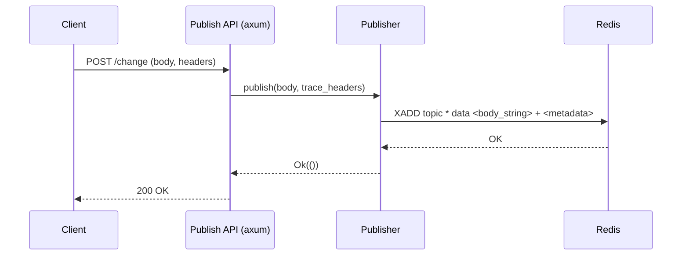

# AGENTS.md

Publish-API is an `axum` web-service that receives data via HTTP and publishes it to a Redis stream. It is invoked by `Change Dispatcher` component of Drasi `Source`s.

-   **Configuration**: Reads `QUERY_NODE_ID`, `REDIS_BROKER`, and `PORT` from environment variables. It will exit if `QUERY_NODE_ID` is not set.

-   **Publisher Initialization**: Creates a `Publisher` instance that connects to the specified Redis broker and publishes to a topic derived from the `QUERY_NODE_ID` (e.g., `{QUERY_NODE_ID}-publish`).

-   **HTTP Endpoints**: 
    -   `/change`: Handles incoming change events.
    -   `/data`: Handles incoming data.

-   **Publishing**: Publishes messages containing the incoming data, along with some tracing metadata like, to the configured Redis stream using the `XADD` command.

## Mermaid Diagram

