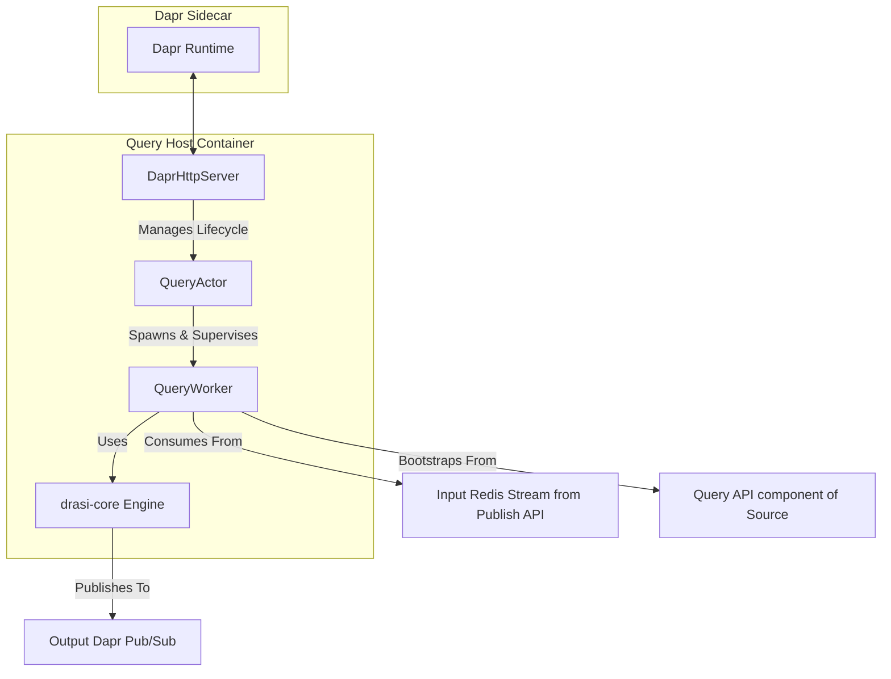
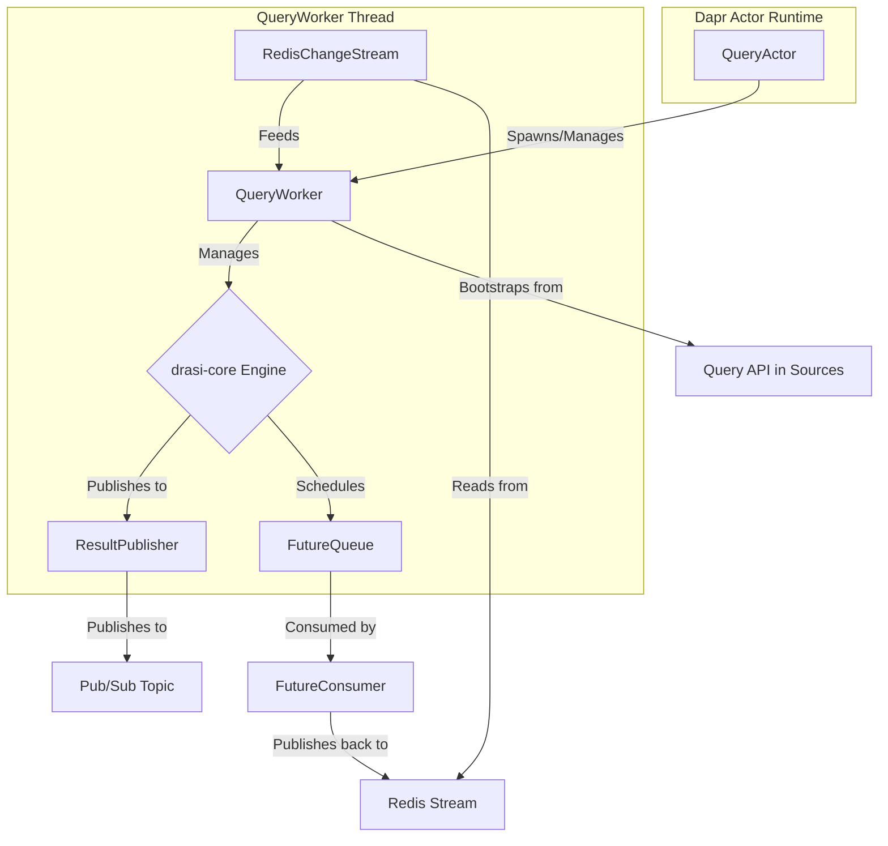

# AGENTS.md: `query-host`

## 1. Purpose & Architectural Intent

This directory contains the `query-host` service, the central component of the `query-container`.

**Core Intent**: To act as a robust, Dapr-enabled host for the `drasi-core` continuous query engine. It is responsible for managing the complete lifecycle of individual queries, making each query a stateful, addressable, and resilient entity.

**Architectural Strategy**:
-   **Dapr Actor Model**: Each continuous query is instantiated as a Dapr `QueryActor`. This pattern is used to:
    -   Manage the state of each query independently (e.g., its configuration, status).
    -   Provide a reliable, addressable endpoint for managing the query's lifecycle (configure, deprovision, reconcile).
    -   Ensure resilience, as Dapr can automatically reactivate actors on failure.
-   **Decoupled Worker Logic**: The `QueryActor` spawns a `QueryWorker` which contains the actual data processing logic. This separates the actor's lifecycle management from the core task of running the query.

## 2. Core Dependencies & Data Flow

-   **`drasi-core` (Git Submodule)**: This is the high-performance, embeddable Rust library that performs the actual continuous query evaluation. The `query-host` acts as a runtime environment for it.
-   **Redis Streams**: The `QueryWorker` consumes a dedicated Redis Stream for each query, ensuring ordered, reliable processing of incoming `ChangeEvent` messages. `publish-api` service publushes the Change Events to the Redis stream.
-   **Dapr Pub/Sub**: After processing data through `drasi-core`, the `QueryWorker` publishes the resulting diffs to a separate Dapr pub/sub topic for consumption by downstream services like the `view-svc`.

## 3. Key Abstractions

-   **`QueryActor`**: The Dapr actor responsible for state management and lifecycle of a single continuous query.
-   **`QueryWorker`**: The core processing loop for a query. It bootstraps data from sources, consumes the change stream, and drives the `drasi-core` engine.
-   **`IndexFactory`**: A factory for providing pluggable storage backends (`ElementIndex`, `ResultIndex`, `FutureQueue`) to `drasi-core`, allowing for different persistence strategies (in-memory, Redis, RocksDB).
-   **`MiddlewareTypeRegistry`**: Enables extensible, declarative data transformation pipelines for pre-processing source data before it reaches the query engine.