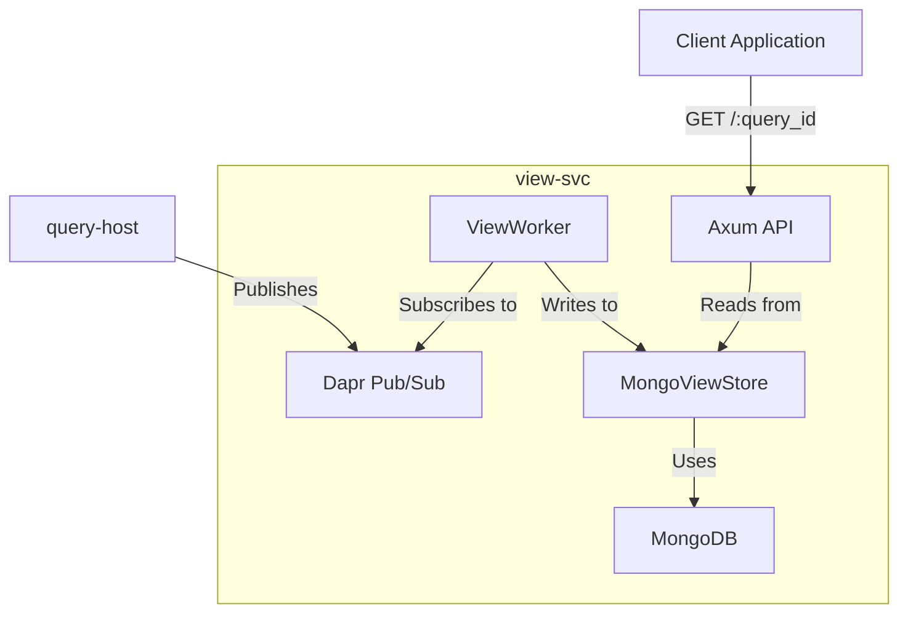

# AGENTS.md: `view-svc`

## 1. Purpose & Architectural Intent

View Service is responsible for creating, managing, and serving materialized views of Drasi continuous query results.

**Core Intent**: To provide a durable, queryable, and time-aware view of the output from a continuous query. It acts as the primary interface for client applications to consume query results.

**Architectural Strategy**:
-   **Dapr Actor Model**: Each view is managed by a Dapr `ViewActor`. This provides a stateful, addressable endpoint for each view's lifecycle (configure, deprovision) and encapsulates its state (e.g., retention policy).
-   **Decoupled Worker Logic**: The `ViewActor` spawns a `ViewWorker` that runs in the background, consuming the result stream for a specific query and updating the materialized view in the database. This decouples the actor's lifecycle from the data processing task.
-   **Temporal Data Model**: The `MongoViewStore` implements a temporal data model. Each result row is stored with `validFrom` and `validTo` timestamps. This allows clients to query the view not just for its current state, but for its state at any point in time.
-   **`RetentionPolicy`**: A key configuration that dictates how historical data is managed in the view (e.g., `Latest`, `Expire`, `All`). A background garbage collection task in the `MongoViewStore` enforces this policy.

## 2. Core Dependencies & Data Flow

-   **Dapr Pub/Sub**: The `ViewWorker` subscribes to a Dapr pub/sub topic to receive `ResultEvent` streams from a `query-host`.
-   **MongoDB**: The `MongoViewStore` uses MongoDB as its persistence layer. It creates a separate collection for each view to store the temporal documents.
-   **Axum**: An Axum-based HTTP server exposes an API for clients to query the view.

