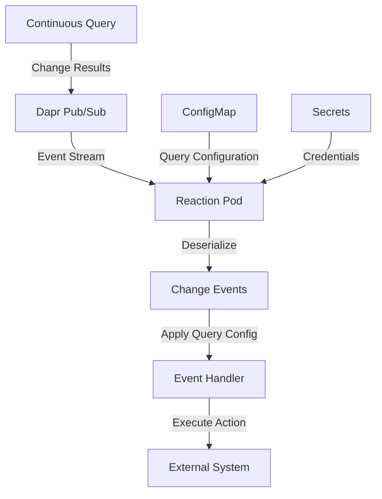

# AGENTS.md: Drasi Reactions

## 1. Architectural Role

-   **Position in Pipeline**: Reactions are the final stage in the Drasi data processing pipeline: **Sources -> Continuous Queries -> Reactions**.
-   **Core Function**: They are event-driven microservices that subscribe to the real-time stream of changes (add, update, delete) from Continuous Queries and execute actions on external systems.
-   **Responsibilities**:
    -   **Integration**: Act as a bridge between Drasi and external systems (e.g., message brokers, databases, APIs).
    -   **Action**: Execute business logic based on query result changes.
    -   **Decoupling**: Separate the change detection logic (the "what" in a query) from the action logic (the "how" in a reaction).

## 2. Core Abstraction: The `ReactionProvider` Model

The architecture separates a reaction's *type definition* from its *instance configuration* using two resource types: `ReactionProvider` and `Reaction`.

### `ReactionProvider`
-   **Role**: Type Definition / Template.
-   **Purpose**: A cluster-level resource that registers a **type** of reaction with the Drasi control plane. It serves as a template and validation schema for all reactions of its kind.
-   **Defines**:
    -   Container image for the reaction's implementation.
    -   Default Dapr settings and service configurations.
    -   A **`config_schema` (JSON Schema)** which serves as a validation contract for all `Reaction` instances of this type. The `mgmt_api` enforces this schema during creation and updates.
-   **Lifecycle**: Registered once per reaction type. Built-in providers are registered during `drasi init`.

### `Reaction`
-   **Role**: Instance / Configured Deployment.
-   **Purpose**: A specific, configured instance of a `ReactionProvider`. This is the running microservice pod.
-   **Defines**:
    -   A reference (`kind`) to its `ReactionProvider`.
    -   Specific `properties` (e.g., connection strings) that conform to the provider's `config_schema`.
    -   The list of `queries` it subscribes to.
-   **Lifecycle**: Created, updated, and deleted as needed by users via the `drasi` CLI.

-   **Key Takeaway**: This model enables a single containerized reaction implementation to be deployed multiple times, each with a unique configuration, subscription list, and lifecycle. For fully annotated YAML examples of both `ReactionProvider` and `Reaction` resources, refer to the `README.md` file in this directory.

## 3. Deployment Orchestration Flow

Applying a `Reaction` manifest via `drasi apply` initiates the following platform-agnostic orchestration flow:

1.  **CLI to Management API**: The `drasi` CLI sends the `Reaction` manifest to the `/v1/reactions/{reaction-name}` endpoint.
2.  **Validation & Persistence**: The Management API validates the `spec.properties` against the `config_schema` from the corresponding `ReactionProvider` and persists the desired state.
3.  **Delegation to Resource Provider**: The Management API delegates the provisioning task to the active resource provider (e.g., `kubernetes_provider`) using the platform-agnostic `resource_provider_api` contract.
4.  **Platform-Specific Resource Generation**: The active resource provider translates the abstract `Reaction` spec into concrete resources. For the default `kubernetes_provider`, this includes:
    -   Kubernetes `Deployment`
    -   Kubernetes `ConfigMap` (for query configurations)
    -   Kubernetes `Service`
    -   Dapr `Component` (for `pubsub.redis` subscription)
5.  **Apply to Platform**: The resource provider applies the generated manifests to the target platform's API (e.g., Kubernetes API).

## 4. Configuration at Runtime

A running reaction container accesses its configuration via two mechanisms:

-   **Environment Variables**: All key-value pairs from the `spec.properties` section of the `Reaction` manifest are injected as environment variables. Values from Kubernetes Secrets are securely resolved and injected.
-   **Volume-Mounted Files**: The `spec.queries` map is stored in a `ConfigMap` and mounted as a file volume at `/etc/queries`.

## 5. Reaction Runtime Data Flow

This diagram illustrates the data flow *inside* a running Reaction pod.

## 6. Examples of Reactions

-   **`PostDaprPubSub`**: Forwards query results to a Dapr Pub/Sub topic for decoupled microservice architectures.
-   **`SyncDaprStateStore`**: Materializes query results into a Dapr state store, creating a continuously updated data cache.
-   **`SignalR`**: Exposes a SignalR endpoint to broadcast query changes for real-time UIs.

## 7. Reaction SDKs

Drasi provides SDKs for multiple languages (located in `reactions/sdk/`) for the development of custom reactions. 
