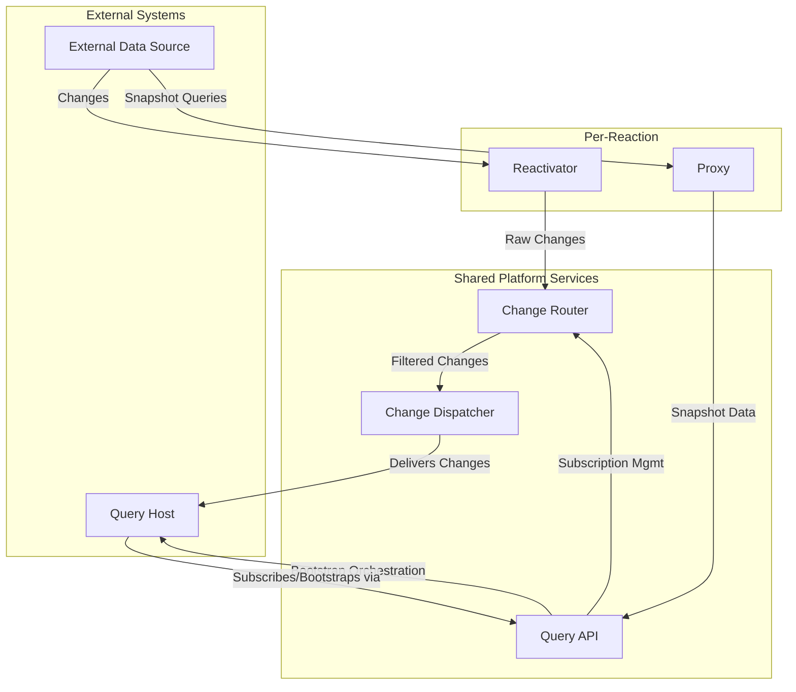

# AGENTS.md: Drasi Sources

## 1. Architectural Role

-   **Position in Pipeline**: Sources are the first stage in the Drasi data processing pipeline: **Sources -> Continuous Queries -> Reactions**.
-   **Core Function**: They are microservice-based connectors that monitor external systems for data changes.
-   **Responsibilities**:
    -   **Connectivity**: Connect to external data systems (databases, APIs, message queues).
    -   **Change Data Capture (CDC)**: Detect `INSERT`, `UPDATE`, and `DELETE` operations in the external system.
    -   **Data Transformation**: Translate the source data into Drasi's internal property graph model (nodes and relationships).
    -   **Bootstrapping**: Provide an initial snapshot of the source data to new queries.

## 2. Core Abstraction: `SourceProvider` vs. `Source`

The architecture separates a source's *type definition* from its *instance configuration* using two resource types.

### `SourceProvider`
-   **Role**: Type Definition / Template.
-   **Purpose**: A cluster-level resource that registers a **type** of source with the Drasi control plane. It serves as a template and validation schema.
-   **Defines**:
    -   Container images for the source's implementation services (`reactivator`, `proxy`).
    -   A **`config_schema` (JSON Schema)** which serves as a validation contract for all `Source` instances of this type.

### `Source`
-   **Role**: Instance / Configured Deployment.
-   **Purpose**: A specific, configured instance of a `SourceProvider`. This is the running set of microservices that connects to a specific external system.
-   **Defines**:
    -   A reference (`kind`) to its `SourceProvider`.
    -   Specific `properties` (e.g., connection strings, tables to watch) that conform to the provider's `config_schema`.
    -   An optional `identity` block for secure authentication.

## 3. Deployment Orchestration Flow

Applying a `Source` manifest via `drasi apply` initiates the following platform-agnostic orchestration flow:

1.  **CLI to Management API**: The `drasi` CLI sends the `Source` manifest to the `/v1/sources/{source-name}` endpoint.
2.  **Validation & Persistence**: The Management API validates the `spec.properties` against the `config_schema` from the corresponding `SourceProvider` and persists the desired state.
3.  **Delegation to Resource Provider**: The Management API delegates the provisioning task to the active resource provider (e.g., `kubernetes_provider`).
4.  **Platform-Specific Resource Generation**: The active resource provider translates the abstract `Source` spec into concrete resources. For the default `kubernetes_provider`, this includes generating Kubernetes `Deployments` and `Services` for the five-component architecture.
5.  **Apply to Platform**: The resource provider applies the generated manifests to the target platform's API (e.g., Kubernetes API).

## 4. The Five-Component Architecture

Every Drasi Source is composed of five distinct microservices. As a source developer, you implement two source-specific components, while the other three are generic, shared services provided by the platform.

-   **Developer-Implemented Components:**
    1.  **Reactivator:** The "change monitor." Detects changes in the source system.
    2.  **Proxy:** The "bootstrap handler." Provides a full data snapshot for new queries.

-   **Shared Platform Components (`/sources/shared`):**
    1.  **Query API:** Handles subscription requests and orchestrates bootstrapping.
    2.  **Change Router:** Routes raw change events from the Reactivator to subscribers based on data labels.
    3.  **Change Dispatcher:** Delivers filtered events to the correct query container instances.

For fully YAML spec and examples of both `SourcesProvider` and `Source` resources, refer to the `README.md` file in this directory.

### Component Interaction Diagram

## 5. Development

Drasi provides SDKs to simplify the development of custom sources. SDKs for various languages are available in the `sources/sdk/` directory.
